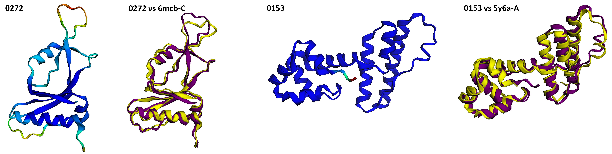

# Rethinking Protein Drug Design with Highly Accurate Structure Prediction of Anti-CRISPR Proteins

<p align="center">
  
  <figcaption align = "center"><b>Fig.1 - Predicted protein structure and the corresponding superimposed image with ground truth for anti_CRISPR0272 and anti_CRISPR0153 </b></figcaption>
</p>

Anti-CRISPR (Acr) proteins serve as the defence mechanism of bacteriophages to counter the bacterial/archaeal adaptive immunity, called CRISPR-Cas systems ([Jansen et al. 2002][2]; [Mojica et al. 2005][4]; [Bondy-Denomy et al. 2013][5]). They are natural protein therapeutics that could be used for future drug design.

Structural and functional analysis of these Acr proteins is essential for them to be used for drug design or in any other capacity. Currently, advanced equipments such as X-ray crystallography, NMR spectroscopy, and cryo-electron microscopy are used to visualize the structure of proteins. These methods are highly accurate, but they can be very time consuming and expensive. To overcome these disadvantages, prediction of protein structures via machine learning has gained a lot of attention as of late. The Critical Assessment of protein Structure Prediction (CASP), for example, is a competition for predicting protein 3-D structures from their sequences. In the 14th CASP contest, AlphaFold ([Jumper et al. 2021][3]; [Callaway 2020][1]) from Google Deepmind achieved highely accurate molecular localization of a variety of proteins and won the contest. AlphaFold can predict protein structures in a matter of hours, which would normally take months in a wet lab.

In our study, we present strategies for drug design using Acr proteins as well as a new family of Acr proteins, structurally similar to those that show enzymatic activities. For this, we make use of the aforementioned AlphaFold to predict the 3-D structures of Acr proteins and perform structural and sequence analysis using the results.

Through this github repository, we share the predicted 3-D structures and sequences of Acr proteins used in our study. We do this for researchers conducting related research, to encourage them to cross-verify the structures predicted by AlphaFold, and to help minimize their time and effort in similar studies. 

All Acr protein sequences were provided by [anti-CRISPRdb](http://guolab.whu.edu.cn/anti-CRISPRdb/) and they have been divided into three sets: Set A, B and C. Set A contains proteins that have been verified as being Acr proteins via both the aforementioned database and other literature. Set B contains proteins that have been verified as being Acr proteins via the database but not through the literature. Lastly, Set C contains proteins that has not been verified yet as being Acr proteins but their 3-D structures have been discovered.

### Our GitHub largely has the following structure:

#### 1. [`protein_sequences`](https://github.com/powersimmani/ACR_alphafold/tree/main/protein_sequences)
- The input protein sequences required for prediction via AlphaFold are stored here. 

#### 2. [`pdb_files`](https://github.com/powersimmani/ACR_alphafold/tree/main/pdb_files)
- [`Alphafold_pdbs_from_protein_sequences`](https://github.com/powersimmani/ACR_alphafold/tree/main/pdb_files/Alphafold_pdbs_from_protein_sequences): The predicted 3-D structures from the input protein sequences are saved here. 
- [`Ground_truth_pdb_files`](https://github.com/powersimmani/ACR_alphafold/tree/main/pdb_files/Ground_truth_pdb_files): The ground truth 3-D structures corresponding to the predicted 3-D structures are stored here. 

#### 3. [`predict_and_ground_truth_matching.xlsx`](https://github.com/powersimmani/ACR_alphafold/blob/main/predict_and_ground_truth_matching.xlsx)
- The information about which `Ground_truth_pdb` matches `Alphafold_pdbs_from_protein_sequences` is saved here. 

#### 4. [`captured_images`](https://github.com/powersimmani/ACR_alphafold/tree/main/captured_images)
- Screenshots are saved for every 3-D structure.
- [`Super_imposed`](https://github.com/powersimmani/ACR_alphafold/tree/main/captured_images/Super_imposed): Screenshots of (overlapped) predictions and ground truth is saved here.

 
<!--## Additional information

%Additional structures, not used in this study can be found in [Set D](link)

## Full prediction result with features

%For the full results from AlphaFold, download this [file](link).

-->
## For citation

Readers may use the following information to cite our research and dataset.

```
Park, H. M. et al. (2021). Rethinking protein drug design with highly accurate structure prediction of anti-CRISPR proteins. bioRxiv. https://doi.org/https://doi.org/10.1101/2021.11.28.470242
```
<!--Rethinking protein drug design with highly accurate structure prediction of anti-CRISPR proteins. bioRxiv. 
Ho-min Park, Yunseol Park, Joris Vankerschaver, Arnout Van Messem, Wesley De Neve, Hyunjin Shim
bioRxiv 2021.11.28.470242; doi: https://doi.org/10.1101/2021.11.28.470242
-->

```
@article {Park2021.11.28.470242,
	author = {Park, Ho-min and Park, Yunseol and Vankerschaver, Joris and Van Messem, Arnout and De Neve, Wesley and Shim, Hyunjin},
	title = {Rethinking protein drug design with highly accurate structure prediction of anti-CRISPR proteins},
	elocation-id = {2021.11.28.470242},
	year = {2021},
	doi = {10.1101/2021.11.28.470242},
	publisher = {Cold Spring Harbor Laboratory},
	journal = {bioRxiv}
}
```
**Please feel free to contact us using 'issues' or the following email address: homin.park@ghent.ac.kr**

**Contributors**:
 - [Ho-min Park](https://github.com/powersimmani)
 - [Yunseol Park](https://github.com/YunseolPark)
 - [Joris Vankerschaver](https://github.com/jvkersch)
 - [Arnout Van Messem](https://github.com/avmessem)
 - [Wesley De Neve](https://github.com/wmdeneve)
 - [Hyunjin Shim](https://github.com/hjshim)


## References
[Callaway, E. ‘It will change everything’: DeepMind’s AI makes gigantic leap in solving protein structures. Nature 588, 203–204 (2020).][1]

[Jansen, R., van Embden, J. D. A., Gaastra, W. & Schouls, L. M. Identification of genes that are associated with DNA repeats in prokaryotes. Mol. Microbiol. 43, 1565–1575 (2002).][2]

[Jumper, J. et al. Highly accurate protein structure prediction with AlphaFold. Nature 596, 583–589 (2021).][3]

[Mojica, F. J. M., Díez-Villaseñor, C., García-Martínez, J. & Soria, E. Intervening sequences of regularly spaced prokaryotic repeats derive from foreign genetic elements. J. Mol. Evol. 60, 174–182 (2005).][4]

[Bondy-Denomy, J., Pawluk, A., Maxwell, K. et al. Bacteriophage genes that inactivate the CRISPR/Cas bacterial immune system. Nature 493, 429–432 (2013).][5]

[1]: https://link.springer.com/article/10.1007%2Fs00239-004-0046-3 "Callaway, E. ‘It will change everything’: DeepMind’s AI makes gigantic leap in solving protein structures. Nature 588, 203–204 (2020)."
[2]: https://onlinelibrary.wiley.com/doi/full/10.1046/j.1365-2958.2002.02839.x?sid=nlm%3Apubmed  "Jansen, R., van Embden, J. D. A., Gaastra, W. & Schouls, L. M. Identification of genes that are associated with DNA repeats in prokaryotes. Mol. Microbiol. 43, 1565–1575 (2002)."
[3]: https://www.ncbi.nlm.nih.gov/pmc/articles/PMC8371605/ "Jumper, J. et al. Highly accurate protein structure prediction with AlphaFold. Nature 596, 583–589 (2021)."
[4]: https://link.springer.com/article/10.1007%2Fs00239-004-0046-3 "Mojica, F. J. M., Díez-Villaseñor, C., García-Martínez, J. & Soria, E. Intervening sequences of regularly spaced prokaryotic repeats derive from foreign genetic elements. J. Mol. Evol. 60, 174–182 (2005)."
[5]: https://rdcu.be/cCbDz "Bondy-Denomy, J., Pawluk, A., Maxwell, K. et al. Bacteriophage genes that inactivate the CRISPR/Cas bacterial immune system. Nature 493, 429–432 (2013)."
## Acknowledgement

The research and development activities described in this paper were funded by Ghent University Global Campus (GUGC).
